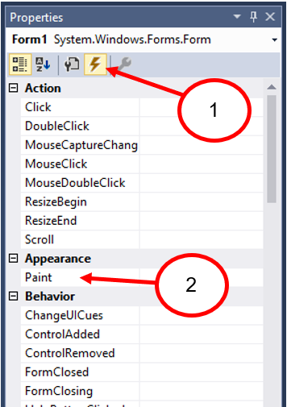

# Week 09 การเขียนโปรแกรมกราฟฟิกส์ด้วย GDI+

# 1. กล่าวนำ
ใบงานนี้ มีวัตถุประสงค์ เพื่อให้นักศึกษา ได้รู้จักกับ GDI+ ซึ่งจะช่วยให้นักษาสามารถ
อธิบายระบบพิกัดใน GDI+ ได้ สามารถใช้คำสั่งพื้นฐานของ GDI+ ในการวาดกราฟฟิกส์อย่างง่ายได้

# 2. เนื้อหา 
## 2.1. เกี่ยวกับ GDI+ 
GDI+ (Graphics Device Interface Plus) เป็นกราฟฟิกส์ไลบรารี่ ซึ่ง Microsoft จัดเตรียมไว้ให้นักพัฒนาโปรแกรมได้ใช้ทำงานด้านกราฟฟิกส์ โดยที่ GDI+ จะมีลักษณะเป็น OOP เต็มตัว  

ก่อนที่จะมี GDI+ ไมโครซอฟท์มีไลบรารี่ชื่อ GDI ซึ่งอยู่ในไฟล์ gdi32.dll ติดตั้งมาบน Windows ทุกตัวจนกระทั่งมาถึงยุค Windows XP ทางไมโครซอฟท์ก็ได้ปรับปรุง GDI ให้มีความสามารถมากขึ้น โดยให้ชื่อว่า GDI+ และยังคงใช้ต่อมาจนถึงวินโดวส์รุ่นปัจจุบัน
## 2.2. ความสามารถของ GDI+
 ความสามารถของ GDI+ จะมีอยู่ 3 ส่วนหลักๆ คือ
* Vector graphics เป็นการสร้างกราฟฟิกส์ 2 มิติ ด้วยรูปทรงเรขาคณิตพื้นฐาน เช่น เส้นตรง(Line) เส้นโค้ง (Curve) สี่เหลี่ยม(Rectangle) วงรี (Ellipse) เป็นต้น

* Imaging นอกจากความสามารถในการวาดภาพด้วยรูปทรงเรขาคณิตแล้ว GDI+ ยังมีความสามารถในด้านการ แสดงผล, Load/Save ไฟล์ภาพชนิดต่างๆ ในรูปของ bitmap (bitmap ในที่นี้หมายถึงไฟล์ภาพทุกชนิด ที่แสดงเป็น pixel และไม่สามารถอธิบายด้วยรูปทรงเรขาคณิตอย่างง่ายๆ ได้ เช่น ภาพถ่าย ภาพสแกน เป็นต้น)

* Typology เป็นการจัดการเกี่ยวกับฟอนต์ ซึ่งมีความสามารถในการแสดงผลแบบ anti aliasing ทำให้ขอบของตัวอักษรดูเรียบขึ้นมากกว่าการเขียนโปรแกรมด้วย GDI

## 2.3. ระบบพิกัดใน GDI+ 
ใน GDI+ จะมีระบบพิกัดที่ใช้งานอยู่เป็นจำนวน 3 ระบบ คือ World coordinate, Page coordinate และ Device coordinate

* World coordinate จะทำงานกับระบบหน่วยที่ใช้ในชีวิตประจำวัน เช่น หน่วยมิลลิเมตร หรือ หน่วยนิ้ว เป็นต้น

* Page coordinate จะทำงานกับระบบ coordinate บนหน้ากระดาษ และจะสามารถพิมพ์ออกทางเครื่องพิมพ์ตามขนาดที่กำหนดบน page coordinate

* Device coordinate จะทำงานกับ pixel บนจอหรือบนเครื่องพิมพ์

# 3. การทดลอง


### เริ่มต้นกับ C# และ GDI+
1. เรียกโปรแกรม Visual Studio
2. สร้าง Project ใหม่ เป็นชนิด C# โดยมีชื่อ project คือ GDIPlus_1


__รูปที่ 1__ การสร้าง Project ชนิด Windows Form App (.NET Framework)

3.	เมื่อ Wizard สร้าง Project เสร็จแล้ว จะนำเรามาที่หน้าต่าง Form1.cs[Design] ให้คลิกที่ปุ่ม Events ของ Properties pane ตาม (1) และ Double click ที่ Paint ตาม (2)




__รูปที่ 2__ การเพิ่ม event ให้กับ Paint


4.	เพื่อให้โปรแกรมของเราสามารถใช้งาน GDI+ ในการวาดภาพ 2D ได้ ให้ทำการเพิ่ม “using System.Drawing.Drawing2D;”  ลงในบรรทัดที่ 10 ดังรูป


__รูปที่ 3__ การเพิ่ม using System.Drawing.Drawing2D;

5. ให้เพิ่มบรรทัดต่อไปนี้ลงในฟังก์ชัน private void Form1_Paint(object sender, PaintEventArgs e)

  5.1 สร้าง Object ของกราฟิกส์ โดยคำสั่ง Graphics g = e.Graphics; ซึ่ง Object ชื่อ e ถูกส่งผ่านมาทาง argument ของฟังก์ชัน

  5.2 เพิ่มออบเจกต์ของปากกา สีน้ำเงินขนาด 2 พิกเซล ด้วยคำสั่ง Pen = new Pen(Color.Blue, 2);

  5.3 วาดสี่เหลี่ยมด้วยคำสั่ง g.DrawRectangle(bluepen, 10, 10, 100, 100);

  5.4 คืนหน่วยความจำให้ระบบโดยการลบออบเจ็กต์ปากกาสีน้ำเงิน โดยคำสั่ง bluepen.Dispose();


__รูปที่ 4__ ตัวอย่างการแก้ไขเมธอด Form1_Paint


6.	ทดลอง Build และ Run โปรแกรมและบันทึกผล

```
  บันทึกผลการทดลอง

```

## 3.1 การใช้สี 

### 3.1.1 การใช้สีโดยการผสมค่าสี
7.	เพิ่ม Code ต่อไปนี้ลงในฟังก์ชัน private void Form1_Paint(object sender, PaintEventArgs e) 

 

__รูปที่ 5__ การใช้สีโดยการผสมค่าสี

8.	รันโปรแกรมและบันทึกผล 

```
  บันทึกผลการทดลอง

```

### 3.1.2 การใช้สี โดยการใช้เมธอด FromName

9.	เพิ่ม Code ต่อไปนี้ลงในฟังก์ชัน private void Form1_Paint(object sender, PaintEventArgs e)
 
  

__รูปที่ 6__ การใช้สี โดยการใช้เมธอด FromName

10.	รันโปรแกรมและบันทึกผล 

```
  บันทึกผลการทดลอง

```


## 3.2 การใช้ปากกา

### 3.2.1 ขนาดและสีของปากกา
11.	การทดลองเปลี่ยนขนาดและสีของปากกา โดยใช้ properties Width และ Color
 

  

__รูปที่ 7__ ขนาดและสีของปากกา

12.	รันโปรแกรมและบันทึกผล 


```
  บันทึกผลการทดลอง

```

### 3.2.2 ชนิดของปากกาเป็นเส้นประ
13.	เปลี่ยนชนิดของปากกาเป็นเส้นประ

  

__รูปที่ 8__ เปลี่ยนชนิดของปากกาเป็นเส้นประ

14.	รันโปรแกรมและบันทึกผล 

```
  บันทึกผลการทดลอง

```


### 3.2.3 การใช้ปากกา (Pen) ร่วมกับแปรงทาสี (Brush)
15.	เขียนโปรแกรมใช้ปากการ่วมกับแปรงทาสี

  

__รูปที่ 9__ การใช้ปากการ่วมกับแปรงทาสี

16.	รันโปรแกรมและบันทึกผล 

```
  บันทึกผลการทดลอง

```


### 3.2.4 ใช้ Pen ร่วมกับ HatchBrush เพื่อสร้างลายเส้นแบบต่างๆ
17.	ใช้ Pen ร่วมกับ HatchBrush เพื่อสร้างลายเส้นแบบต่างๆ
 
 

__รูปที่ 10__ ใช้ Pen ร่วมกับ HatchBrush เพื่อสร้างลายเส้นแบบต่างๆ

18.	รันโปรแกรมและบันทึกผล 

```
  บันทึกผลการทดลอง

```

## 3.3 การวาดเส้นตรง

### 3.3.1 การวาดเส้นตรงเชื่อมต่อระหว่างจุด จำนวน 2 จุด
19.	การวาดเส้นตรง เป็นการเชื่อมต่อระหว่างจุด จำนวน 2 จุด โดยใช้ออบเจกต์ Pen เป็นตัวกำหนดลักษณะของเส้น ให้แก้ไข code ต่อไปนี้ในฟังก์ชัน private void Form1_Paint(object sender, PaintEventArgs e)

 

 
__รูปที่ 11__ การวาดเส้นตรงเชื่อมต่อระหว่างจุด จำนวน 2 จุด

20.	รันโปรแกรมและบันทึกผล 

```
  บันทึกผลการทดลอง

```


### 3.3.2 การวาดเส้นตรงด้วย pen style และ brush
21.	การวาดเส้นตรงด้วย pen style และ brush

 
 
__รูปที่ 12__ การวาดเส้นตรงด้วย pen style และ brush

22.	รันโปรแกรมและบันทึกผล 


```
  บันทึกผลการทดลอง

```


### 3.3.3 การกำหนดจุดปลายของเส้นตรงด้วย style แบบต่างๆ
23.	การกำหนดจุดปลายของเส้นตรงด้วย style แบบต่างๆ
 
 

__รูปที่ 13__ การกำหนดจุดปลายของเส้นตรงด้วย style แบบต่างๆ

24.	รันโปรแกรมและบันทึกผล 

```
  บันทึกผลการทดลอง

```

## 3.4 การวาดเส้นโค้ง

### 3.4.1  การวาดเส้นโค้งด้วยเมธอด DrawCurve(...)
25.	การวาดเส้นโค้งโดยการกำหนดจุดไว้ใน array ของ point แล้วส่งให้กับฟังก์ชัน DrawCurve(...) 
 
 

__รูปที่ 14__ การวาดเส้นโค้งด้วยเมธอด DrawCurve(...)

26.	รันโปรแกรมและบันทึกผล 

```
  บันทึกผลการทดลอง

```

### 3.4.2  การวาดเส้นโค้งด้วย Graphics path

27.	การวาดเส้นโค้งด้วย Graphics path
 
  

__รูปที่ 15__ การวาดเส้นโค้งด้วย Graphics path

28.	รันโปรแกรมและบันทึกผล 

```
  บันทึกผลการทดลอง

```


## 3.5 การวาดรูปทรงต่างๆ

### 3.5.1  การวาดสี่เหลี่ยมครั้งละรูป

29.	การวาดสี่เหลี่ยมครั้งละรูปเดียว
 

  

__รูปที่ 16__ การวาดสี่เหลี่ยมครั้งละรูปเดียว

30.	รันโปรแกรมและบันทึกผล 

```
  บันทึกผลการทดลอง

```


### 3.5.2  การวาดสี่เหลี่ยมพร้อมกันครั้งละหลายๆ รูป

31.	การวาดสี่เหลี่ยมพร้อมกันครั้งละหลายๆ รูป
 

  

__รูปที่ 17__ การวาดสี่เหลี่ยมพร้อมกันครั้งละหลายๆ รูป

32.	รันโปรแกรมและบันทึกผล 

```
  บันทึกผลการทดลอง

```

### 3.5.3  การวาดวงกลมและวงรี

33.	วงรีต่างจากวงกลมตรงที่เส้นผ่านศูนย์กลางในแกนตั้งและแกนนอนจะไม่เท่ากัน ในภาษาโปรแกรมส่วนใหญ่จะมีเฉพาะฟังก์ชันวาดวงรี ถ้าต้องการวาดวงกลม ให้กำหนดเส้นผ่านศูนย์กลางในแกนตั้งและแกนนอนให้เท่ากัน

  

__รูปที่ 18__ การวาดวงกลมและวงรี

34.	รันโปรแกรมและบันทึกผล 

```
  บันทึกผลการทดลอง

```


### 3.5.4  การวาดส่วนโค้ง (Arc)

35.	การวาดส่วนโค้ง (Arc)
 

 

__รูปที่ 19__ การวาดส่วนโค้ง (Arc)

36.	รันโปรแกรมและบันทึกผล 

```
  บันทึกผลการทดลอง

```


### 3.5.4  การวาดรูป Pie

37.	การวาดรูป Pie

 

__รูปที่ 20__ การวาดรูป Pie


38.	รันโปรแกรมและบันทึกผล 

```
  บันทึกผลการทดลอง

```


### 3.5.5  การสร้าง graphics path จากรูปต่างๆ

39.	การสร้าง graphics path จากรูปต่างๆ

 

__รูปที่ 21__ การสร้าง graphics path จากรูปต่างๆ

40.	รันโปรแกรมและบันทึกผล 

```
  บันทึกผลการทดลอง

```

## 3.6 การใช้งานแปรงระบายสี (Brush)

### 3.6.1  การระบายสีด้วย SolidBrush
41.	การระบายสีด้วย SolidBrush

 
 
__รูปที่ 22__ การระบายสีด้วย SolidBrush

42.	รันโปรแกรมและบันทึกผล 

```
  บันทึกผลการทดลอง

```

### 3.6.2  การระบายสีด้วย HatchBrush
43.	การระบายสีด้วย HatchBrush
 
 

__รูปที่ 23__ การระบายสีด้วย HatchBrush

44.	รันโปรแกรมและบันทึกผล 

```
  บันทึกผลการทดลอง

```

### 3.6.3  การระบายสีด้วย TextureBrush

45.	การระบายสีด้วย TextureBrush

 
 
__รูปที่ 24__ การระบายสีด้วย TextureBrush

46.	รันโปรแกรมและบันทึกผล 

```
  บันทึกผลการทดลอง

```


### 3.6.4  การระบายสีด้วย TextureBrush บน panel

47.	การระบายสีด้วย TextureBrush บน panel


 

__รูปที่ 25__ การระบายสีด้วย TextureBrush บน panel

48.	รันโปรแกรมและบันทึกผล 

```
  บันทึกผลการทดลอง

```


### 3.6.5 การระบายสีด้วย Path Gradient Brush

49.	การระบายสีด้วย Path Gradient Brush
 
 

__รูปที่ 26__ การระบายสีด้วย Path Gradient Brush

50.	รันโปรแกรมและบันทึกผล 

```
  บันทึกผลการทดลอง

```


## 3.7 การใช้งานภาพ

### 3.7.1  การโหลดภาพชนิดต่างๆ มาแสดงบนฟอร์ม

51.	การโหลดภาพชนิดต่างๆ มาแสดงบนฟอร์ม

 

__รูปที่ 27__ การโหลดภาพชนิดต่างๆ มาแสดงบนฟอร์ม

52.	รันโปรแกรมและบันทึกผล 

```
  บันทึกผลการทดลอง

```


### 3.7.2 การ Zoom out

53.	การ Zoom out

 

__รูปที่ 28__ การ Zoom out

54.	รันโปรแกรมและบันทึกผล 

```
  บันทึกผลการทดลอง

```

### 3.7.3 การ Zoom in

55.	การ Zoom in
 
 


__รูปที่ 29__ การ Zoom in

56.	รันโปรแกรมและบันทึกผล 

```
  บันทึกผลการทดลอง

```

### 3.7.4 การพลิกและหมุนภาพ

57.	การพลิกและหมุนภาพ
 
 

__รูปที่ 30__ การพลิกและหมุนภาพ

58.	รันโปรแกรมและบันทึกผล 

```
  บันทึกผลการทดลอง

```


### 3.7.5 การเขียนข้อความลงในภาพ
59.	การเขียนข้อความลงในภาพ

 

__รูปที่ 31__ การเขียนข้อความลงในภาพ

60.	รันโปรแกรมและบันทึกผล 

```
  บันทึกผลการทดลอง

```


## References

[Graphics Methods](https://msdn.microsoft.com/en-us/library/system.drawing.graphics_methods%28v=vs.110%29.aspx)
 
[System.Drawing Namespace](https://msdn.microsoft.com/en-us/library/system.drawing%28v=vs.110%29.aspx)

[GDI+ .NET Color & HatchStyle Chart](https://drewnoakes.com/snippets/GdiColorChart/)


